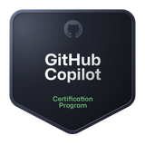
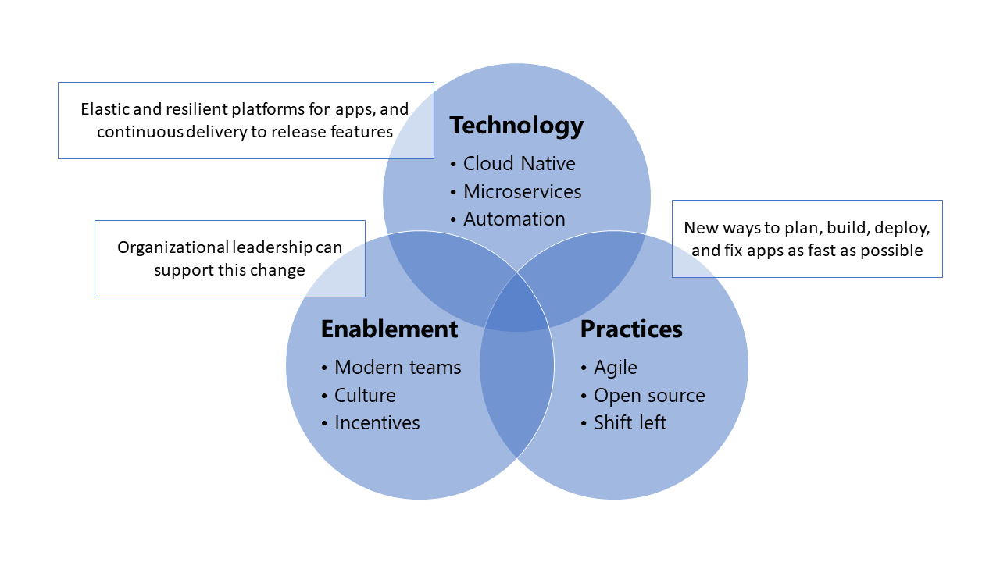

💼 I am an App Innovation Specialist at Microsoft - guiding customers into building new AI apps (or AI features in existing apps).

🏆 Ask me about Agile, product-based work, engineering autonomy and trust, OKRs, and communities of practice.

🤓 I can deliver application architecture/design sessions in my sleep. My real love is Azure App Service, but I've been working with GitHub a lot lately.

